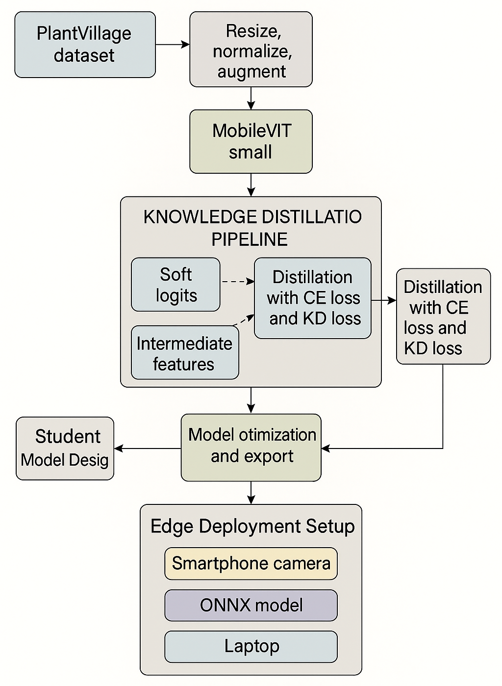
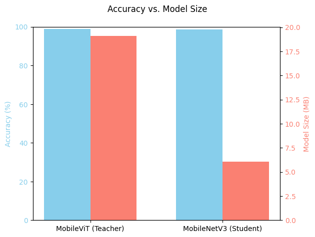
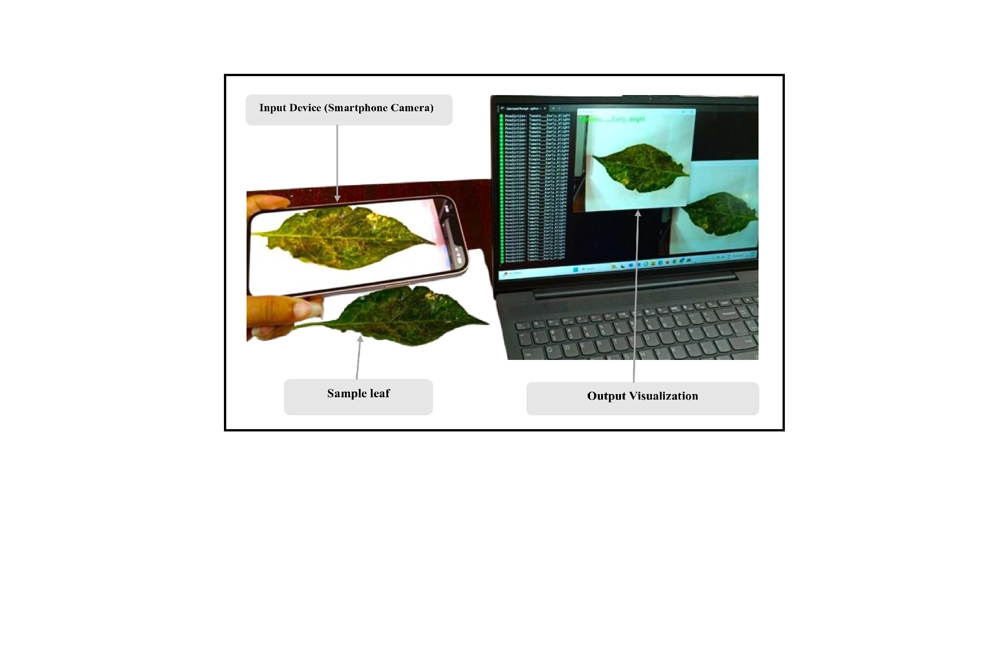

# Edge-AI Powered Plant Disease Detection using Knowledge Distillation

This project presents a lightweight and deployable Edge-AI system for plant disease detection using Knowledge Distillation and real-time inference.

## 📄 Project Report
📥 [View Full Thesis](./bachelors_thesis.pdf)

## 🚀 Overview
- Developed a high-accuracy plant disease detection system for edge devices
- Used Knowledge Distillation to compress deep learning models
- Achieved real-time inference using smartphone + laptop setup
- Designed for real-time edge deployment in resource-constrained environments

## 🧠 Methodology

### 🔹 Teacher Model
- MobileViT (high accuracy ~98.89%)

### 🔹 Student Model
- MobileNetV3 (lightweight, efficient)

### 🔹 Knowledge Distillation
- Logit-based distillation
- Combined loss: Cross-Entropy + KL Divergence
- Temperature scaling (T = 4)

## 📱 Real-Time Deployment

- Live inference using smartphone camera (DroidCam) + laptop setup
- ONNX Runtime used for efficient edge inference
- Achieved ~20–25 FPS in real-world conditions

## 📊 Results

- Accuracy: **98.69%**
- Model size reduced from **19.1 MB → 6.07 MB (3× compression)**
- Inference speed improved from **15.13 ms → 7.32 ms**
- Real-time performance: **20–25 FPS**

## 📂 Dataset

- 🌿 [PlantVillage Dataset](https://www.kaggle.com/datasets/emmarex/plantdisease)  
  - ~54,000 images across 38 classes (controlled conditions)

- 🌾 [CGIAR Crop Disease Dataset](https://www.kaggle.com/datasets/shadabhussain/cgiar-computer-vision-for-crop-disease)  
  - Real-world images captured from UAVs and smartphones

## 🛠 Tech Stack
Python, PyTorch, OpenCV, ONNX Runtime, NumPy, Pandas

## 💻 Code
- Jupyter Notebook: `edge_ai_detection.ipynb`
- Python Script: `main.py`

## 📸 Sample Results

### Knowledge Distillation Pipeline

### Model Performance

### Real-Time Deployment

## 📁 Code Structure

- `edge_ai_detection.ipynb` → Knowledge Distillation training pipeline  
- `inference.py` → Real-time camera inference  
- `inference_fps.py` → FPS-based inference  
- `evaluate.py` → Model evaluation  
- `app.py` → Streamlit web app  
- `main.py` → Core implementation

  
## ⚡ Key Features

- Real-time plant disease detection using live camera feed
- ONNX-optimized inference for edge deployment
- Knowledge Distillation for model compression (3× reduction)
- Performance monitoring using FPS and latency metrics
- Web-based interface using Streamlit

## 📦 Note
Dataset and trained models are not included due to size limitations.

## 🔗 Future Work
- Deploy on Raspberry Pi / Jetson Nano
- Multi-modal inputs (temperature, humidity)
- Mobile app integration

 ## 🌐 Web Application

Run the Streamlit app:
streamlit run src/app.py

## ⚙️ Installation
pip install -r requirements.txt

